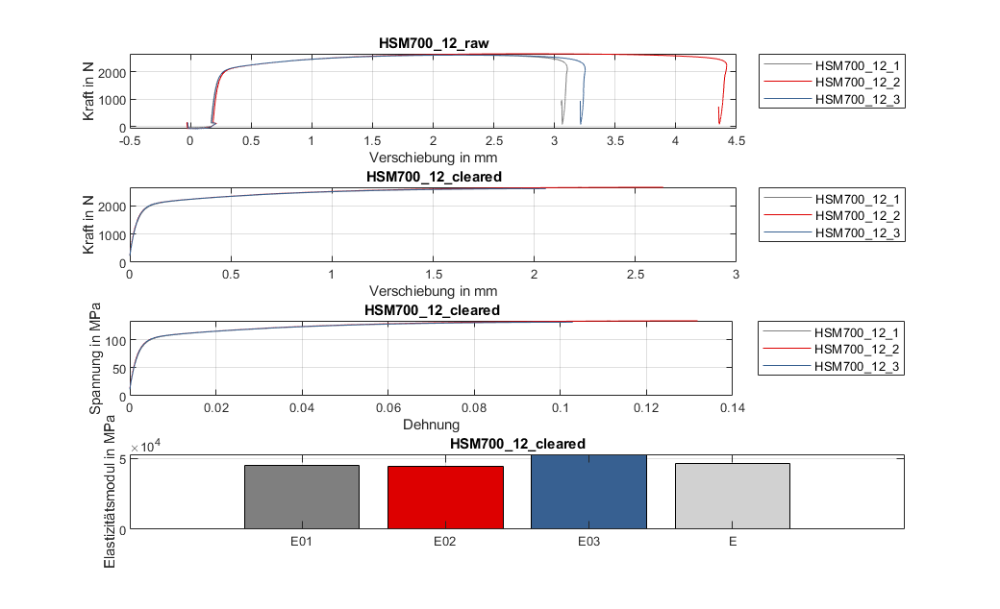

# eval_TensileTest
Automated evaluation of tensile test experiments.

- Import based on user-defined file names
- Noise elimination
- Data centering
- Calculation of technical and true stress/strain quantities
- Flow curve determination by using polynomial regression

